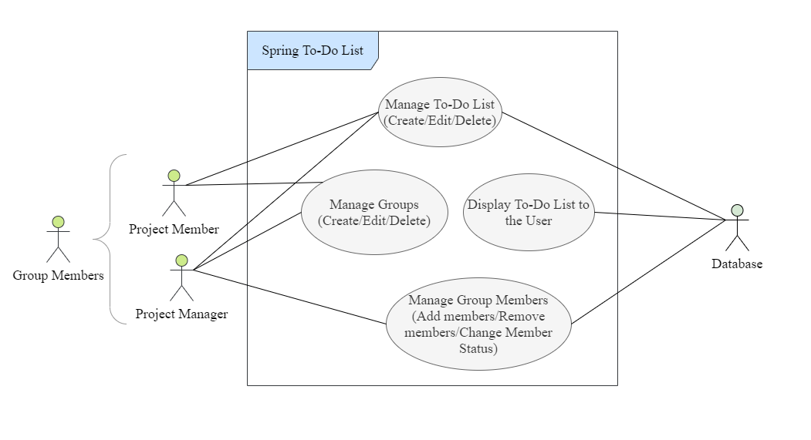

# The Spring Boot To-Do List: Making Project Organization Spring to Life

## Project Overview
The Spring-Boot To Do List is a group project management system that allows for project managers to delegate tasks and responsibilities to their group members, and track their progress. Our Spring-Boot To Do List offers a quick, concise, and easy-to-use interface that allows users to gather and exchange information about their groups' responsibilities. Additionally, through our virtual task organization/delegation platform, each group member has different roles assigned to them by project managers, that associates certain groups with a given task should no specific user be assigned a task. Through employing this system, users can manage their groups' tasks and their groups' members productivity in a clean, efficient manner.

## Vision Statement
For teams working on a group project, who need a scheme to coordinate responsibilities and communicate tasks to be accomplished in real-time, the Spring Boot To-Do List is a web-based group project coordination platform that project managers of small teams can use to delegate tasks to their members, who can set the completion statuses of their specific tasks, delegate priority status to urgent responsibilities to hold specific individuals accountable for their tasks, and leave feedback regarding the different tasks to enable communication about setbacks and suggestions. Unlike other Project Management services such as Trello or Jira, our product provides a simple and user-friendly interface that even those who may not have as much experience with digital devices can use without issue, so that even those not as experienced with technology to collaborate effectively.

## Personas

### Developer (Jason)
Vincent, age 27, is a video game developer residing in Philadelphia, a city with a bustling atmosphere and many prominent industries. He works with a small team of other developers to create a racing game. Vincent was born and raised in Camden, New Jersey, where his father is a financial consultant and his mother works in asset management. He has a degree in Computer Science from the New Jersey Institute of Technology and held an internship as a Software Solutions Consultant. 

Vincent's experience as a video game developer demonstrates that he is well-versed in using all sorts of different digital technologies. He believes that having an organized schema to catalog the backlog for his team's project is essential towards effective coordination of his team's responsibilities. To that end, Vincent is interested in using the Spring Boot To-Do List for such purposes because he believes that having an easy-to-use and organized project management system would prevent overlapping task delegation and other setbacks. In particular, he believes that a priority scheme of marking down urgent tasks is essential due to the massive backlog his team has, making it easy to lose track of important features. Having a simple, easy-to-use task organization application allows for his team to focus their efforts entirely on their game, and little time fumbling around with the Spring Boot To-Do List.

### Student (Jaime)
Maria, age 20, is a college student pursuing her bachelor’s degree in Marketing at Temple University in Philadelphia, PA. She is involved in multiple clubs and organizations on her campus, even playing on the basketball team as point-guard. As a student athlete, she is familiar with working on a team towards a mutual goal, and strives to do this as efficiently as possible, even taking on a leadership role when necessary. Ever since starting college, she has been trying to polish her time management skills, since juggling school, her sport, and her social life has been a tough adjustment. She is driven by cutting down time wasted, communicating efficiently, and alleviating stressors. 

As for technology experience, Maria is comfortable with a variety of platforms because of the software required to create graphical representations of her marketing work, including many complicated Adobe programs. Also, being 20 years old, she is an avid user of tech and tends to spend a bit too much time on social media and playing on various apps. 

Recently, Maria has been struggling with a new class that requires her to collaborate with a team of students to create a campaign for a new professional organization on campus. Her team consists of six people who all have different responsibilities for their project, and unfortunately, conflicting schedules. They are only able to meet once a week for a few hours and have a hard time communicating between meetings, which has been slowing down their progress. As the Project Manager, Maria feels pressure to constantly keep up on the development of everyone else’s roles and finds herself needing to remind her group of their goals often. 

Maria would benefit from having a single application that allows her and her campaign group to stay in harmony with each other, whether positive or negative in progress. As the one needing to direct her peers, having the ability to delegate and give feedback on tasks in one place would be extremely timesaving for her. 

### Event Planner (Brandon)
Nelson is an event manager who just started his own business. He has college degrees in both Business and Public Relations. He is an expert at time management and negotiating with vendors, but he sometimes has trouble with organizing himself. He is familiar with technology, but he didn’t use it very often prior to opening his business. He has recently been hired by his local elementary school to organize a field trip to the museum downtown. To make the field trip a success, Nelson must set up a tour ending with a live show performed at the planetarium, both exclusive to the students and their chaperones.

As an event planner, Nelson is expected to know how to negotiate with vendors and prepare backup plans in case of emergency or any other setback, all while keeping a set budget. Nelson has to negotiate a time for the performance at the planetarium, which must be able to satisfy the schedules for the performers, the museum, and the school. To add on to that, Nelson has bought an office for his new business a month prior and needs to pay a mortgage soon, and he has to buy a gift for his older sister’s birthday, which is the day before the scheduled trip.

With so many tasks that need to be satisfied, it can be easy for someone to lose track and forget something important. This is why Nelson has plans for downloading the Spring Boot To-Do List, as the app would help him organize his tasks in an orderly and efficient manner. That way, Nelson will be able to keep track of what he has to do, record a set budget for each task, and prepare for any extra requests that may pop up. The interface of the app is easy to learn and quick to use, perfect for anyone who has to deal with a lot of work.

### Construction Manager (Aryanna)
John, age 39, is a construction manager in the Pennsylvania area. His latest project is working with Temple University in the creation of a new dorm on their campus. John has been a construction manager for the last five years. Before that he was a private contractor performing specialized jobs for different clients. The highest level of formal education John has is getting his diploma from high school. After that he took part in a construction apprenticeship where he started his journey in the field. John is pretty inexperienced when it comes to technology and devices and only knows the basic functionalities. However, John has worked in the construction business long enough to understand each part of the construction process clearly and knows how to stay organized throughout large projects like these. 

The construction of this new dorm will involve many people: architects, electricians, engineers, contractors, and sub-contractors must all work together to build this new dorm. Due to the large number of tasks and people needed to create the final product, John is thinking of using the Spring Boot To Do List as a way to remain organized and communicate throughout the process.

He can use this application to oversee the planning, design, and construction of the dorm from beginning to end. He can create groups, assign tasks to specific people, and prioritize tasks.  With the help of this application, John will be able to stay up to date on the status of the project at any given time and make sure everyone is doing their part. It will also help John control the project's delivery, cost, and quality. With the Spring Boot To Do List’s simple interface and easy to use features, someone like John, with no real technical experience, can still successfully use the application to meet his needs. 

## Project Description
For my proposal, I decided to create a standalone project of a To-Do list for Group Project Management, utilizing Spring Boot to develop the backend, displaying a list of things that need to be completed through a web page. Project Managers can create and manage their groups, as well as manage individuals apart of their projects, who can make changes to their shared To-Do Lists, coordinating objectives through the website. 

Simple and easy-to-use, the To-Do list also shows urgent items, and ranks items by priority, further facilitating ease of schedule management. I came up with this idea because in a course like Software Design, where assignments are more team-focused, having some method of coordinating tasks would not only be convenient for a group, but also having a more dedicated to-do list would make it easier to find the tasks that the group should do, as opposed to a list of items in a group chat or some other communication medium.

### Use Case Diagram

## How this Project meets the Goals of this Course
This project adheres to the educational goals of CIS-3296: Software Design through giving an opportunity for students to gain experience with Java-based Frameworks for developing standalone, production-ready spring applications. While the REST API that Spring Boot employs is not using XML-RPC, the REST API provides the ability to build an HTTP API. The Spring-based backend will access a To-Do List stored in a MySQL database (or some other database) that is returned to a web page invoking the server. Since this project will be created from scratch, the team responsible for the creation of this project will employ Test-Driven Development to properly develop the To-Do List server. These goals are important in the context of Software Design since it offers a perspective in developing a fully functional software application from the ground up, utilizing many different concepts discussed in this course to do so. 

## About the Components and Conceptual Design
The main components involved in this project are Spring Boot, MySQL, and Postman. Spring Boot is an open source Java-based framework designed to develop standalone, production-grade Spring-based Applications. Spring Boot utilizes the Spring framework, which provides a programming and configuration model for Java-based applications or any other deployment platforms. MySQL, which will be used for the database component of the Project, is a database management system that allows users to manage relational databases, which has a GUI component through MySQL Workbench. Lastly, Postman will be utilized as a platform for API development to create HTTP Requests for testing the results that the server returns.

The program involves using a web page as a client program to manage their To-Do Lists, located in a database. Users can create their own group and invite others to their group, to access a To-Do List for a group project. Additionally, users can manage the to-do lists in the groups they are in, adding items, modifying items, and checking off items from their lists. These operations are sent to the Spring Boot server as an HTTP Request, which will invoke a MySQL database to make the changes specified by the client. The Spring Server will be responsible for returning these updated entries to the web page. 

## Project
As this is a standalone project, I created a preliminary project folder containing a very basic version of the project's implementation. I made sure to add some Spring Boot setup for those unfamiliar with creating Spring Boot projects, as well as a preliminary connection to a local MySQL database (should probably be changed once it goes public; this was mainly for testing purposes). 

For the frontend of the app I created a separate frontend folder, and then initialized a react app within the folder.

## Building
- Install Spring Boot compatibility into your Java IDE. I used Eclipse for my IDE. 
- Clone the repository, and open it in the IDE.
- Open the pom.xml file in the Project, which will install the dependencies required to run the Project.
- For the frontend, make sure to download node.js and npm to your local machine.
- If you do not have these packages installed you can download them from https://nodejs.org/en/
- After cloning the repository to your local machine you want to cd into the frontend folder.
- Then run npm install to get all the necessary packages installed.

## Running
- For the backend, select "Run As → Spring Boot App" to run the Spring Boot Application. For different IDEs, this may show something different.
- For the frontend, type npm start in the terminal while in the frontend folder. This should start running the react project in the browser. (on port 3000).

## Required Resources
- MySQL Server (and maybe MySQL Workbench) (I used version 5.7)
- Java IDE compatible with Spring Boot (e.g. IntelliJ, Eclipse)
- Postman (for making HTTP Requests for testing)
- An IDE for developing web pages (e.g. NetBeans, Visual Studio Code)

## Addendum - Required Resources
- The Spring Boot To-Do List's frontend component will utilize the React framework
- AWS (Amazon Web Services) will be used for hosting the application
  - An Amazon RDS (Relational Database Service) instance will be created via Amazon Aurora
- Omitting requirement of using MySQL Server, instead utilizing MySQL Workbench through connecting to the Amazon Aurora RDS instance

## References
- [Trello Backlog List](https://trello.com/b/Qy9eTECb/spring-boot-todo-backlog)
- [Trello Technical List](https://trello.com/b/Z5Kv0DSh/spring-boot-to-do-technical)
